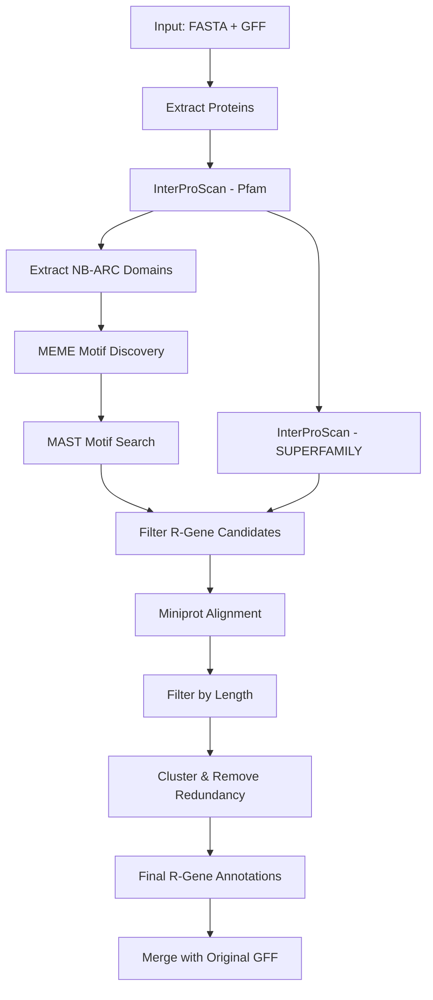

# nf-HRPv2

**Prediction of NB-LRR Resistance Genes Based on Sequence Homology**

[](https://www.nextflow.io/)
[](https://sylabs.io/singularity/)

A Nextflow pipeline for genome-wide identification and annotation of NB-LRR (Nucleotide-Binding Leucine-Rich Repeat) resistance genes. This pipeline predicts candidate R-genes by leveraging conserved protein domains (NB-ARC, LRR) and motif patterns specific to plant immune receptors.

## Overview

NB-LRR proteins are the largest class of plant immune receptors that recognize pathogen effectors and trigger defense responses. This pipeline automates the identification process through:

1. **Protein extraction** from genome annotations
2. **Domain prediction** using InterProScan (Pfam, SUPERFAMILY)
3. **Motif discovery** using MEME suite
4. **Candidate filtering** based on domain architecture (NB-ARC + LRR)
5. **Gene model refinement** using Miniprot alignment
6. **Non-redundant R-gene annotation** with clustering

## Attribution

This project is forked and modified from:
- [nf-hrp](https://github.com/nschan/nf-hrp) by Niklas Schandry
- [HRP](https://github.com/AndolfoG/HRP) by Andolfo et al.

### Citation

If you use this pipeline, please cite the original publication:

> Andolfo, G., Di Donato, A., Chiaiese, P., De Natale, A., Pollio, A., Jones, J. D., ... & Ercolano, M. R. (2022). **Alien domains shaped the modular structure of plant NLR proteins.** *The Plant Journal*, 111(3), 811-823. https://doi.org/10.1111/tpj.15756

---

## New Features in v2

### 🆕 Singularity Container Support
Full singularity support with automatic container engine detection. The pipeline now works on HPC clusters that require singularity instead of Docker.

### 🆕 `--interproscan_data` Parameter
New parameter to specify the path to InterProScan data directory, solving the common issue of missing Pfam databases when running in containers.

### 🆕 MPIPZ HPC Profile
Pre-configured profile for clusters requiring specific mount points (`/scratch`, `/netscratch`).

### 🆕 Improved Container Definitions
All modules now use singularity-aware container patterns that automatically select the correct image format based on your container engine.

---

## Installation

### Prerequisites
- [Nextflow](https://www.nextflow.io/) (≥23.04.0)
- [Singularity](https://sylabs.io/singularity/) or Docker
- InterProScan data files (for domain prediction)

### Clone the Repository
```bash
git clone https://github.com/ykaya/nf-HRPv2.git
cd nf-HRPv2
```

---

## Usage

### Basic Usage
```bash
nextflow run main.nf -profile singularity \
    --samplesheet samples.csv \
    --interproscan_data /path/to/interproscan-5.67-99.0/data
```

### HPC Usage
```bash
nextflow run main.nf -profile singularity \
    --samplesheet samples.csv
```

### Available Profiles

| Profile | Description |
|---------|-------------|
| `singularity` | Generic singularity profile |
| `mpipz` | MPIPZ HPC cluster with /scratch and /netscratch mounts |
| `charliecloud` | Charliecloud container support |
| `conda` | Conda environments |
| `biohpc_gen` | BioHPC Genomics cluster (SLURM) |
| `local` | Local execution |

---

## Input Files

### Samplesheet Format (CSV)

Create a CSV file with the following columns:

```csv
sample,fasta,gff
Accession_1,/path/to/genome1.fasta,/path/to/annotations1.gff3
Accession_2,/path/to/genome2.fasta,/path/to/annotations2.gff3
Col-0,/data/genomes/Col0.fasta,/data/annotations/Col0.gff3
```

| Column | Description |
|--------|-------------|
| `sample` | Unique sample identifier (used in output naming) |
| `fasta` | Absolute path to genome assembly FASTA file |
| `gff` | Absolute path to gene annotations in GFF3 format |

### Example Samplesheet
```csv
sample,fasta,gff
Abd-0,/data/assemblies/Abd-0.fasta,/data/annotations/Abd-0.gff3
Bur-0,/data/assemblies/Bur-0.fasta,/data/annotations/Bur-0.gff3
Col-0,/data/assemblies/Col-0.fasta,/data/annotations/Col-0.gff3
```

---

## Output Files

The pipeline produces the following outputs in the `results/` directory:

| Output | Description |
|--------|-------------|
| `*_proteins.fasta` | Extracted protein sequences |
| `*_proteins.tsv` | InterProScan domain annotations |
| `*_NB.bed` | NB-ARC domain coordinates |
| `*_meme_out.txt` | Discovered motifs |
| `*_mast_geneIDs.txt` | Genes matching R-gene motifs |
| `*NLR_table.tsv` | Full NLR annotation table |
| `*NLR_genes.tsv` | Filtered full-length NLR candidates |
| `*_nlrs_miniprot.gff` | Miniprot-refined gene models |
| `*_R_genes_merged.gff` | Final non-redundant R-gene annotations |
| `*_liftoff_nlr_merge.gff` | Merged original + predicted annotations |

---

## InterProScan Configuration

### ⚠️ Important: Data Directory Binding

InterProScan requires access to its database files (Pfam, SUPERFAMILY, etc.) which are **not included** in the container image. You must bind-mount your local InterProScan data directory.

### Option 1: Using `--interproscan_data` Parameter
```bash
nextflow run main.nf -profile singularity \
    --samplesheet samples.csv \
    --interproscan_data /path/to/interproscan-5.67-99.0/data
```

### Option 2: Edit singularity.config
Modify `configs/singularity.config` to set the path permanently:
```groovy
singularity {
    runOptions = '-B /your/path/to/interproscan/data:/opt/interproscan/data'
}
```

### Finding Your InterProScan Data Path
```bash
# If InterProScan is installed via module:
module load interproscan
which interproscan.sh
# Look for 'data/' folder in the installation directory

# Common locations:
# /software/interproscan-5.67-99.0/data
# /opt/interproscan/data
```

---

## Pipeline Workflow



---

## Parameters

| Parameter | Default | Description |
|-----------|---------|-------------|
| `--samplesheet` | Required | Path to input CSV file |
| `--out` | `./results` | Output directory |
| `--interproscan_data` | null | Path to InterProScan data directory |
| `--cds_feature` | `CDS` | Feature type to extract from GFF |
| `--exclude_pattern` | `ATMG` | Pattern to exclude (e.g., mitochondrial genes) |
| `--mast_gene_pattern` | `AT[1-5C]G[0-9]+.[0-9]+\|evm[0-9a-z\\.]*` | Regex for gene ID extraction |

---

## Planned Features

- [ ] **Genome-wide Statistics**: Summary of predicted R-genes per chromosome
- [ ] **Protein Sequence Export**: Extract final protein sequences from candidates
- [ ] **Visualization**: R-gene distribution plots across chromosomes
- [ ] **Phylogenetic Analysis**: Automated tree building of NB-ARC domains
- [ ] **MultiQC Report**: Integrated quality control summary

---

## Troubleshooting

### Error: Pfam HMM file not found
```
Error: File existence/permissions problem in trying to open HMM file data/pfam/36.0/pfam_a.hmm
```
**Solution**: Set the `--interproscan_data` parameter or configure the mount in your profile config.

### Error: Read-only file system (/scratch)
```
A call to mkdir was unable to create the desired directory: /scratch
```
**Solution**: Use your `own` profile or add `-B /scratch` to singularity runOptions.

### Error: MPI initialization failed
**Solution**: Use `cleanEnv = true` in your singularity config to avoid environment conflicts.

---

## Author

**Yasin Kaya**  
Max Planck Institute for Plant Breeding Research (MPIPZ)

📧 Email: ykaya@mpipz.mpg.de | yyasinkkaya@gmail.com

---

## License

This project is licensed under the MIT License - see the [LICENSE](LICENSE) file for details.

---

## Acknowledgments

- [nf-hrp](https://github.com/nschan/nf-hrp) - Niklas Schandry
- [HRP](https://github.com/AndolfoG/HRP) - Andolfo et al.
- [Nextflow](https://www.nextflow.io/) - Paolo Di Tommaso
- [InterProScan](https://www.ebi.ac.uk/interpro/) - EMBL-EBI
